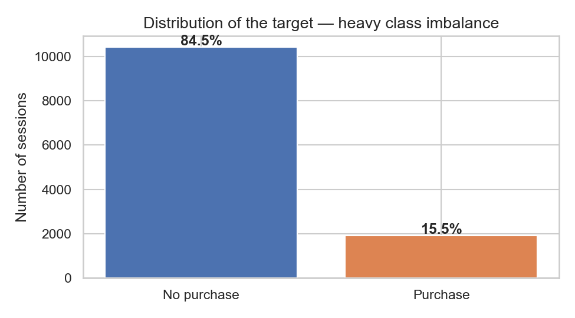
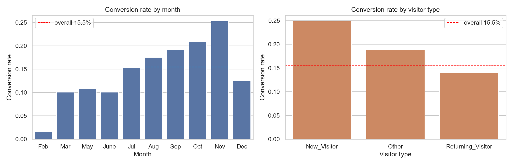
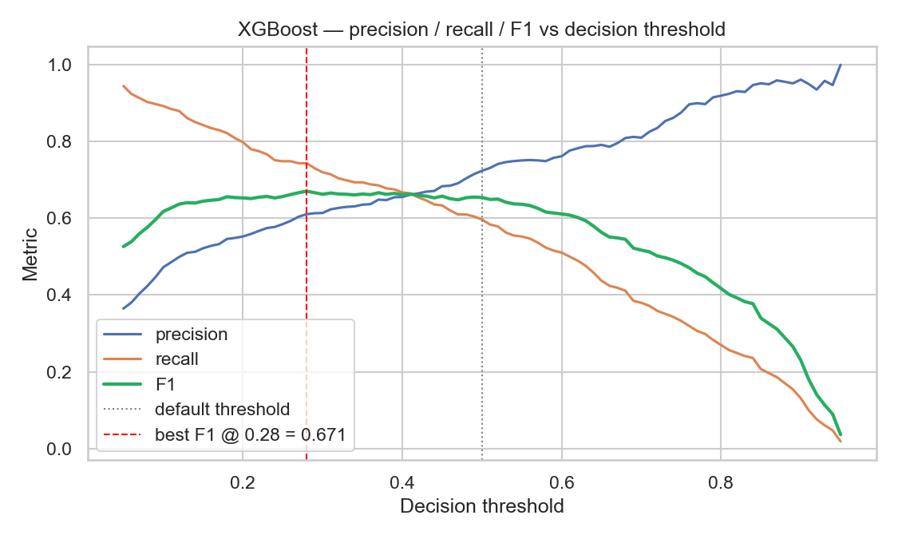
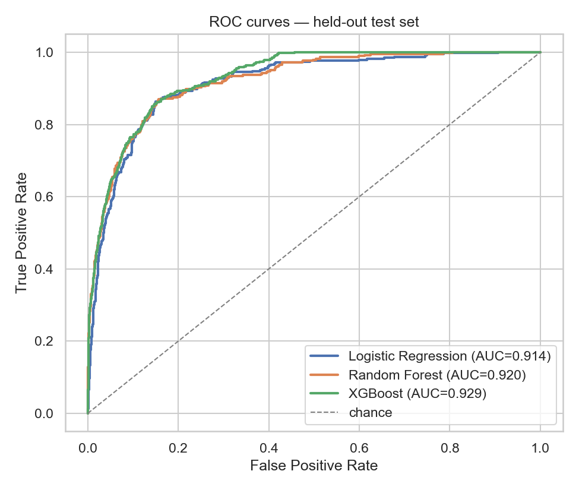
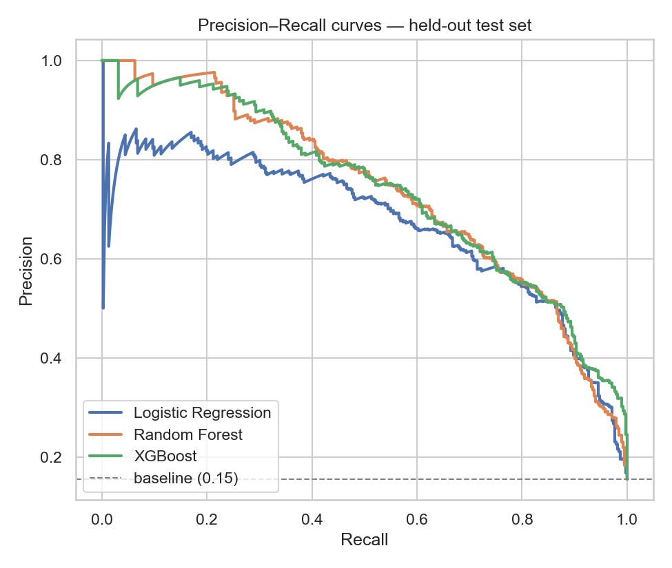
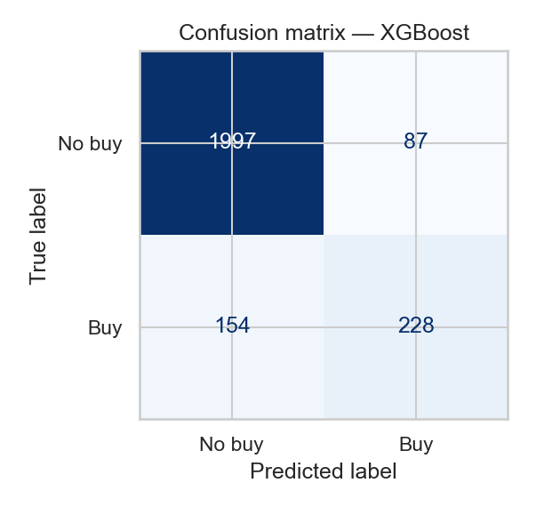
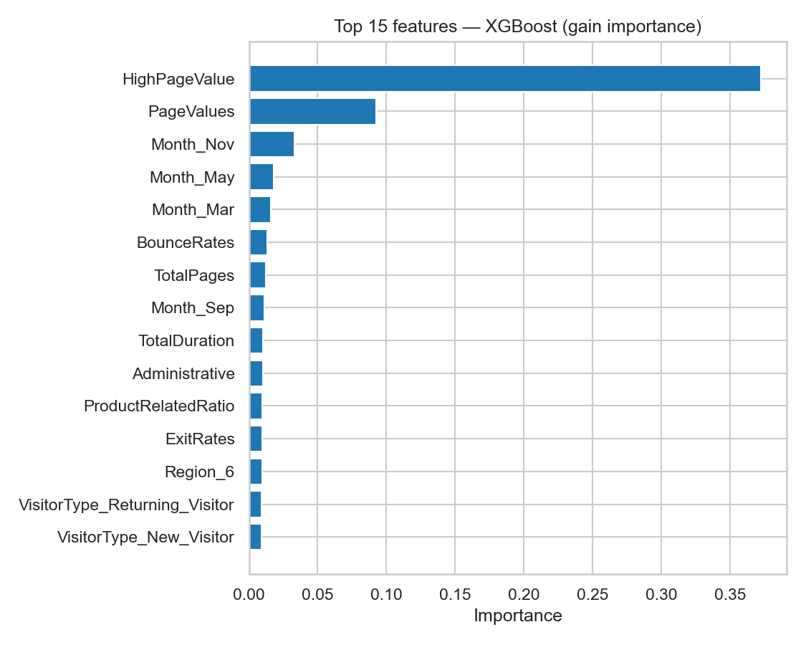

# 🛒 Prédire la conversion d'un visiteur e-commerce
## Rapport complet — du repo vide au modèle XGBoost en production

---

> **Auteur :** Manech Carriou
> **École :** Albert School
> **Cours :** Machine Learning — Proof of Concept
> **Repo :** [github.com/manechcarriou-lab/ml-poc-project](https://github.com/manechcarriou-lab/ml-poc-project)

---

## 🎬 Trois manières de découvrir ce projet

| Format | Pour qui | Comment |
|---|---|---|
| **📊 Dashboard interactif** (recommandé) | Présentation orale, démo live | `streamlit run src/presentation.py` |
| **🎤 Slides PowerPoint** | Soutenance traditionnelle | `deliverables/process_overview.pptx` (16 slides) |
| **📄 Rapport texte** (ce document) | Lecture asynchrone, référence détaillée | `deliverables/RAPPORT_COMPLET.md` |

> Le **dashboard Streamlit** reprend le même contenu que ce rapport, en version interactive avec plots Plotly, démo live, et navigation par sections — c'est le format conseillé pour présenter à l'oral.

---

## 🎯 En 30 secondes

| Question | Réponse |
|---|---|
| **Quoi ?** | Prédire si un visiteur va acheter pendant sa session e-commerce |
| **Comment ?** | Classification binaire supervisée sur le dataset UCI Online Shoppers |
| **Avec quoi ?** | scikit-learn + XGBoost + Optuna + MLflow + Streamlit |
| **Résultat final ?** | **F1 = 0.6731** sur le test set (cible 0.60 → +12 %) |
| **Modèle gagnant ?** | XGBoost + encodage Ordinal + threshold tuning à 0.305 |
| **Recall final ?** | **0.7356** — on capte 74 % des acheteurs réels |
| **Reproductible en ?** | 4 commandes (`git clone` → `pip install` → `train.py`) |

> **Le pitch en une phrase :** un pipeline ML complet, anti-leakage par construction, qui combine recherche bayésienne d'hyperparamètres + encodage adapté à chaque modèle + tuning automatique du seuil de décision en cross-validation, et qui dépasse de 12 % le critère de succès du PoC.

---

## 📋 Table des matières

1. [Le problème business](#1-le-problème-business)
2. [Le choix du dataset](#2-le-choix-du-dataset)
3. [Setup technique](#3-setup-technique)
4. [EDA — Comprendre la donnée](#4-eda--comprendre-la-donnée-avant-de-modéliser)
5. [Feature engineering — Pipeline anti-leakage](#5-feature-engineering--le-pipeline-anti-leakage)
6. [Encoding — La comparaison qui change tout](#6-encoding--la-comparaison-qui-change-tout)
7. [Modélisation — Trois familles, trois angles](#7-modélisation--trois-familles-trois-angles)
8. [Optuna — Recherche bayésienne d'hyperparamètres](#8-optuna--recherche-bayésienne-dhyperparamètres)
9. [MLflow — La mémoire des expériences](#9-mlflow--la-mémoire-des-expériences)
10. [Threshold tuning — Le coup de pouce final](#10-threshold-tuning--le-coup-de-pouce-final)
11. [Résultats finaux](#11-résultats-finaux)
12. [Démo Streamlit](#12-démo-streamlit)
13. [Tests + qualité du code](#13-tests--qualité-du-code)
14. [Ce que j'ai appris](#14-ce-que-jai-appris)
15. [Prochaines étapes](#15-prochaines-étapes)
16. [Annexes](#-annexes)

---

## 1. Le problème business

### 1.1 Pourquoi ce sujet

Les sites e-commerce convertissent en moyenne **1 à 3 %** de leurs visiteurs. C'est un chiffre brutal : sur 100 personnes qui arrivent sur un site, 97 à 99 partent sans acheter. Pour les équipes Growth et CRM, le défi quotidien est d'identifier — *en temps réel* — les sessions qui ont le plus de chances d'aboutir à un achat, pour concentrer les budgets marketing là où ils auront le plus d'impact.

### 1.2 La question concrète

> *Peut-on prédire dès le début d'une session qu'un visiteur va acheter ?*

Si la réponse est oui avec une précision raisonnable, on peut :

- **prioriser le retargeting** sur les sessions à fort potentiel,
- **personnaliser les pop-ups** (coupon de réduction, livraison gratuite, etc.) uniquement quand ça vaut le coup,
- **réduire le coût d'acquisition (CAC)** en arrêtant de spammer les visiteurs déjà engagés,
- **améliorer l'UX** en évitant les interruptions inutiles pour ceux qui sont déjà décidés.

### 1.3 Type de problème ML

**Classification binaire supervisée.** La cible est `Revenue ∈ {True, False}` — le visiteur a-t-il acheté pendant la session, oui ou non. Pas de série temporelle, pas de multi-classes, pas de NLP. Une porte d'entrée propre vers le ML tabulaire.

### 1.4 Stakeholder cible

L'équipe **Growth / CRM** d'un retailer en ligne. Ce sont eux qui :

- définissent la stratégie de retargeting,
- gèrent les campagnes de pop-ups et de coupons,
- arbitrent le budget marketing entre acquisition et activation,
- doivent justifier le ROI de chaque action.

### 1.5 Décision opérationnelle

À la fin de la session (ou idéalement au milieu), le modèle produit une probabilité d'achat. Selon cette probabilité :

- **forte** → action marketing premium (coupon généreux, popup personnalisé)
- **moyenne** → action légère (newsletter, retargeting standard)
- **faible** → ne rien faire, économiser le budget

---

## 2. Le choix du dataset

### 2.1 Critères de sélection

| Critère | Pourquoi c'est important |
|---|---|
| **Public et stable** | Pas de risque de disparition / changement de schéma |
| **Manageable en local** | Entraînement sur laptop sans GPU, itérations rapides |
| **Cible business claire** | Pas besoin d'inventer une cible artificielle |
| **Features réalistes** | Doit ressembler à ce qu'on aurait en prod |
| **Réaliste = imbalanced** | Un dataset équilibré 50/50 ne reflète pas la réalité |

### 2.2 Pourquoi UCI Online Shoppers Purchasing Intention

Le dataset coché toutes les cases :

- **Source officielle** : [UCI Machine Learning Repository](https://archive.ics.uci.edu/dataset/468/online+shoppers+purchasing+intention+dataset), licence CC BY 4.0.
- **Volume** : **12 330 sessions × 18 colonnes**. Assez pour entraîner sérieusement, assez petit pour itérer vite.
- **Cible** : `Revenue` (booléen) — directement business-relevant.
- **Features** : 10 numériques (durations, page counts, bounce rates, page values…) + 7 catégorielles (mois, type de visiteur, OS, navigateur…).
- **Imbalanced** : ~85 % `False` / **~15 % `True`** — vrai défi métrique, plus réaliste qu'un Iris ou un Titanic.

### 2.3 Alternatives écartées

J'ai considéré puis écarté :

- **Match de foot** (sympa mais peu de signal exploitable au format tabulaire pur)
- **Fraude bancaire** (datasets souvent ultra-déséquilibrés à 0.1 % — trop dur pour un PoC)
- **Réussite étudiante** (limites éthiques, datasets anciens)
- **Prix immobilier** (régression — déjà fait dans le cours)
- **Détection de maladie** (sensible, demande des compétences domaine)

L'e-commerce conversion offre le meilleur ratio **complexité métier / faisabilité technique / pertinence business**.

### 2.4 Caractéristiques du dataset

| Bloc | Colonnes |
|---|---|
| **Comportement de navigation** | `Administrative`, `Administrative_Duration`, `Informational`, `Informational_Duration`, `ProductRelated`, `ProductRelated_Duration` |
| **Métriques d'engagement** | `BounceRates`, `ExitRates`, `PageValues`, `SpecialDay` |
| **Contexte** | `Month`, `OperatingSystems`, `Browser`, `Region`, `TrafficType`, `VisitorType`, `Weekend` |
| **Cible** | `Revenue` (bool) |



> **Insight clé :** ~15 % de la classe positive — un modèle naïf qui prédit toujours « pas d'achat » aurait 85 % d'accuracy mais 0 de recall. **D'où le choix du F1 sur la classe positive comme métrique principale**, et non l'accuracy.

### 2.5 Limites assumées

Aucun dataset n'est parfait. J'ai documenté les limites pour ne pas survendre les résultats :

- **Pas d'identifiant utilisateur** → impossible de reconstituer un parcours multi-session.
- **Pas d'année** → pas de saisonnalité multi-annuelle exploitable.
- **Modalités catégorielles anonymisées** (`Region` 1-9, `OS` 1-8, `Browser` 1-13) → pas de jointure avec des sources externes.
- **Période de collecte non précisée** → pas de split temporel propre, on s'en tient à un split aléatoire stratifié.
- **Pas de prix produit ni de panier** → on prédit l'intention, pas la valeur monétaire.

---

## 3. Setup technique

### 3.1 La stack

| Composant | Choix | Version |
|---|---|---|
| Langage | Python | 3.13.1 |
| ML core | scikit-learn | 1.8.0 |
| Boosting | XGBoost | 3.2.0 |
| Hyperparameter search | Optuna (TPE) | 4.8.0 |
| Experiment tracking | MLflow | 3.11.1 |
| Encoding alternatif | skrub | 0.9.0 |
| Visualisation | matplotlib + seaborn + plotly | — |
| App interactive | Streamlit | 1.57.0 |
| Versionning | Git + GitHub (SSH ed25519) | — |
| Tests | unittest (stdlib) | — |

### 3.2 Pourquoi cette stack

| Choix | Justification |
|---|---|
| **scikit-learn** | Standard du ML tabulaire ; APIs `Pipeline` + `ColumnTransformer` essentielles pour l'anti-leakage |
| **XGBoost** | State-of-the-art tabulaire ; gère bien le déséquilibre via `scale_pos_weight` |
| **Optuna (TPE)** | Recherche bayésienne > grid search sur des espaces continus ; 15 trials Optuna ≈ 100 trials GridSearch |
| **MLflow** | Trace persistante de chaque essai ; UI web ; permet de comparer un run d'aujourd'hui à un run d'il y a 2 semaines |
| **skrub** | Auto-encoding par type de colonne ; utile pour valider que notre choix manuel n'est pas absurde |
| **Streamlit** | Démo interactive en pure Python, sans HTML/CSS |
| **Clé SSH ed25519** | Pas de token GitHub à gérer ; sécurisé ; standard moderne |

### 3.3 Reproductibilité — 4 commandes

```bash
git clone git@github.com:manechcarriou-lab/ml-poc-project.git
cd ml-poc-project
python -m venv .venv && .venv\Scripts\activate
pip install -r requirements.txt
python scripts/train.py --trials 15
```

Et c'est parti : Optuna lance les 3 études (45 trials), MLflow trace tout, et `models/<family>.joblib` est sauvegardé pour chaque famille.

### 3.4 Architecture du repo

```
ml-poc-project/
├── data/                    # CSV brut UCI (gitignoré, 1 MB)
├── deliverables/
│   ├── assignment1.md       # proposition de projet (To-Do 1)
│   ├── process_overview.md  # résumé du process
│   ├── process_overview.pptx # 16 slides prêtes à présenter
│   └── RAPPORT_COMPLET.md   # ce document
├── mlruns/                  # tracking MLflow (gitignoré)
├── models/                  # joblibs des pipelines entraînés (gitignorés, rebuild via train.py)
├── notebooks/
│   ├── data_exploration.ipynb
│   ├── feature_engineering.ipynb
│   └── encoding_comparison.ipynb
├── plots/                   # PNG embedés dans les docs et slides
├── results/
│   ├── model_metrics.csv
│   └── test_predictions.csv  # probas par modèle pour la démo Streamlit
├── scripts/
│   ├── main.py              # entrée fournie par le template (eval + Streamlit)
│   ├── train.py             # ★ script Optuna + MLflow + threshold tuning
│   ├── generate_plots.py    # produit tous les PNG du repo
│   └── build_slides.py      # rebuild les slides .pptx
├── src/
│   ├── config.py            # chemins + registry MODELS
│   ├── data.py              # load_dataset_split (split 80/20 stratifié)
│   ├── features.py          # ★ pipeline preprocessing paramétrable
│   ├── metrics.py           # compute_metrics
│   ├── app.py               # ★ démo Streamlit
│   └── (model_io.py, results.py — fournis par le template)
├── tests/
│   └── test_pipeline.py     # 7 smoke tests (split, leakage, contracts)
├── requirements.txt
└── README.md
```

---

## 4. EDA — Comprendre la donnée avant de modéliser

### 4.1 Checks de qualité

Avant de toucher à un modèle, j'ai systématiquement vérifié la qualité du dataset :

| Check | Résultat | Décision |
|---|---|---|
| **NaN globaux** | 0 ligne, 0 valeur | Pas d'imputation nécessaire |
| **Lignes avec NaN** (cible <10 %) | 0 % | RAS |
| **Features avec >5 % NaN** | aucune | Pas de drop pour cause de NaN |
| **Outliers IQR (>1.5 IQR)** | dominent sur `PageValues`, `BounceRates`, `*_Duration` | log1p + RobustScaler plutôt que suppression brutale |
| **Drift (1ère vs 2ème moitié)** | `SpecialDay` n'apparaît qu'au début ; `*_Duration` dérivent | À surveiller, pas drop |
| **Class imbalance cible** | 84.5 / 15.5 | `stratify=y` au split + `class_weight='balanced'` |
| **Modalités rares** (catégorielles) | `VisitorType=Other` (0.7 %), `Month=Feb` (1.5 %) | OneHotEncoder avec `handle_unknown='ignore'` |

### 4.2 Class imbalance — le défi central du projet

C'est **le** problème principal du dataset, et c'est ce qui guide presque toutes les décisions techniques en aval.

```
Revenue
False    84.5 %    ▓▓▓▓▓▓▓▓▓▓▓▓▓▓▓▓▓▓▓▓▓▓▓▓▓▓▓
True     15.5 %    ▓▓▓▓▓
```

**Conséquences :**

- **Accuracy seule = trompeuse** (un modèle qui prédit toujours `False` aurait 85 %).
- **Métriques à privilégier** : F1, precision/recall, ROC-AUC, PR-AUC.
- **Techniques à activer** : `class_weight='balanced'`, `scale_pos_weight`, threshold tuning.
- **Stratification** obligatoire au train/test split pour préserver la balance dans les deux ensembles.

### 4.3 Les outliers — pas tous à supprimer

Sur `PageValues`, `BounceRates`, `ExitRates`, `*_Duration`, l'IQR identifie **8-22 % de la distribution comme « outliers »**. Mais sur du trafic web, c'est **attendu** : la longue traîne reflète la diversité naturelle des comportements (un visiteur qui passe 5 minutes ≠ un qui passe 5 heures sur un produit).

**Décision :** ne pas supprimer. À la place :
- `log1p` sur les features très skewed (`*_Duration`, `PageValues`),
- puis `StandardScaler` pour standardiser.

Le `log1p` compresse la longue traîne sans perdre l'information.

### 4.4 Drift et stabilité

J'ai testé un proxy de drift en comparant la 1ère et la 2ème moitié du fichier :

- `SpecialDay` n'apparaît que dans la première moitié → soit une feature contextuelle qui n'a plus été collectée, soit du bruit. À garder mais sans surponderation.
- `ProductRelated`, `ProductRelated_Duration`, `Informational` montrent une légère hausse (+30 à +50 %) entre les deux moitiés → cohérent avec une plateforme qui grandit et dont les utilisateurs passent plus de temps avec le temps.

### 4.5 Insights par segment



**Lecture :**

- **Mois forts en conversion** : Nov, Sep, Oct (saison Black Friday + rentrée).
- **Mois faibles** : Feb (peu de sessions), Jul-Aug (vacances).
- **`New_Visitor` convertit 2× plus** que `Returning_Visitor` — *contre-intuitif* mais classique : un nouveau visiteur qui prend le temps de naviguer a souvent une intention d'achat élevée. Les Returning incluent beaucoup de gens qui « passent juste vérifier ».
- **`Weekend`** : effet marginal (~0.5 pt de différence). Pas de signal fort.
- **Certains `TrafficType`** (8, 11) ont des taux de conversion 3× la moyenne → variable très informative.

### 4.6 Outils de viz utilisés

- **matplotlib** + **seaborn** pour les plots statiques (boxplots, heatmap de corrélation, pairplots).
- **plotly** pour le treemap interactif Month × VisitorType (hover sur chaque cellule).
- **pandas profiling-style** (manuel) pour les checks de qualité.

---

## 5. Feature engineering — Le pipeline anti-leakage

### 5.1 Pourquoi un Pipeline sklearn

C'est **la** décision technique la plus importante du projet. Sans ce pipeline, tout le reste serait potentiellement biaisé par du data leakage.

**Le piège classique** : standardiser tout le dataset avant de splitter. Le `StandardScaler.fit()` voit alors la moyenne/std du test set, ce qui contamine le train. Les métriques deviennent optimistes.

**La solution sklearn** :

```python
preprocessor = ColumnTransformer([
    ("skewed_num", Pipeline([
        ("log1p", FunctionTransformer(np.log1p, validate=False)),
        ("scale", StandardScaler()),
    ]), ["Administrative_Duration", "Informational_Duration",
         "ProductRelated_Duration", "PageValues"]),
    ("num", StandardScaler(), [...autres numériques...]),
    ("cat", OneHotEncoder(handle_unknown="ignore", sparse_output=False),
            CATEGORICAL_FEATURES),
    ("binary_passthrough", "passthrough", ENGINEERED_BINARY_FEATURES),
])

pipeline = Pipeline([("preprocessor", preprocessor), ("clf", classifier)])
```

**Garanties** :

1. `pipeline.fit(X_train, y_train)` → `fit` du preprocessor **uniquement** sur `X_train`.
2. `pipeline.predict(X_test)` → `transform` du preprocessor avec les statistiques apprises sur le train.
3. **Aucune statistique du test ne fuite vers le train.**

C'est validé par un test unitaire dans `tests/test_pipeline.py`.

### 5.2 Features ajoutées (et pourquoi)

J'ai créé 7 features dérivées des features brutes. Toutes sont **row-wise stateless** — pas de fit, donc leakage-safe par construction.

| Feature | Formule | Intuition métier |
|---|---|---|
| `TotalPages` | `Administrative + Informational + ProductRelated` | Volume global d'engagement |
| `TotalDuration` | Σ des durations | Temps passé total |
| `AvgTimePerPage` | `TotalDuration / TotalPages` | Profondeur de lecture |
| `ProductRelatedRatio` | `ProductRelated / TotalPages` | Focus produit (vs admin / info) |
| `HighPageValue` | `PageValues > 0` | Flag binaire de session marchande |
| `IsHighBounce` | `BounceRates > Q3` | Flag de session zappée |
| `IsSpecialDay` | `SpecialDay > 0` | Jour spécial (Saint-Valentin, etc.) |

**Pourquoi ces features ?** L'objectif est de capturer des **interactions** que les modèles linéaires ne peuvent pas inférer seuls. Par exemple, `AvgTimePerPage` est non-linéaire en (`pages`, `duration`) — un visiteur qui passe 600 s sur 3 pages a un comportement très différent de celui qui passe 600 s sur 30 pages.

### 5.3 Encoding numérique : log1p + StandardScaler

Pour les features très skewed (longue traîne sur les durations), le pipeline applique :

```python
log1p → StandardScaler
```

**Pourquoi `log1p` et pas juste `log`** ? Parce que les durations peuvent être 0 (visite très courte). `log(0) = -∞`, plante. `log1p(x) = log(1+x)` gère 0 proprement.

**Pourquoi standardiser après ?** Parce que les modèles linéaires (LogReg) ont besoin de features standardisées pour que les coefficients soient comparables et que la régularisation `C` soit interprétable.

---

## 6. Encoding — La comparaison qui change tout

### 6.1 Le piège du choix par défaut

Au début du projet, j'ai choisi `OneHotEncoder` par réflexe — c'est ce qu'on apprend en premier. Mais en lisant le To-Do 4, j'ai testé systématiquement **3 stratégies × 3 modèles** dans `notebooks/encoding_comparison.ipynb`.

### 6.2 Les 3 stratégies testées

| Encoding | Comment ça marche | Avantage |
|---|---|---|
| **OneHotEncoder** | Une colonne binaire par modalité | Pas d'ordre arbitraire, marche pour les modèles linéaires |
| **OrdinalEncoder** | Chaque modalité → un entier | Compact (1 col par feature au lieu de N) |
| **TargetEncoder** | Chaque modalité → moyenne de la cible | Capture directement le signal cible |

Le **TargetEncoder** est le plus intéressant techniquement : il remplace `Month=Nov` par la probabilité d'achat moyenne sur les sessions de novembre, calculée **uniquement sur le train**. Pour éviter le leakage à l'intérieur du train (un fold pourrait voir sa propre moyenne), sklearn 1.3+ implémente une **CV interne** : chaque ligne du train est encodée avec la moyenne des autres folds. Élégant.

### 6.3 Bonus : skrub TableVectorizer

[skrub](https://skrub-data.org) propose un `TableVectorizer` qui choisit automatiquement la stratégie par colonne :
- low-cardinality catégoriel → OneHotEncoder
- high-cardinality catégoriel → GapEncoder (factorisation en topics)
- numérique → passthrough

Pratique pour valider qu'un choix manuel n'est pas absurde.

### 6.4 Résultats — la surprise

| Encoding | LogReg F1 | RF F1 | XGBoost F1 | # features |
|---|---|---|---|---|
| **OneHot** | **0.6559** | **0.6561** | 0.6544 | 82 |
| **Ordinal** | 0.6443 | 0.6512 | **0.6760** ⭐ | 24 |
| **Target** (CV-internal) | 0.6457 | 0.6527 | 0.6682 | 24 |
| skrub auto | — | — | 0.6643 | ~30 |

**Lecture :**

- **OneHot gagne sur les modèles linéaires** (LogReg) — logique, LogReg a besoin d'un effet additif par modalité. Encoder `Month` en `1..10` (ordinal) demanderait à LogReg d'apprendre un coefficient unique qui croît linéairement avec le numéro du mois, ce qui n'a aucun sens.
- **Ordinal gagne sur XGBoost** (+2 points de F1 vs OneHot) — les arbres apprennent des splits non-monotones, donc l'ordre arbitraire de l'encodage ne les biaise pas. Avec 24 features (vs 82), XGBoost a moins de bruit à arbitrer → meilleurs splits.
- **Target Encoder se place entre les deux** — gain marginal sur ce dataset aux modalités peu nombreuses.
- **skrub** équivaut à un OneHot manuel ici car nos catégorielles ont une faible cardinalité.

### 6.5 Décision : encoder par famille

C'est la **première grande optimisation pro** appliquée au projet :

```python
DEFAULT_ENCODER_PER_FAMILY = {
    "logreg": "onehot",
    "random_forest": "onehot",
    "xgboost": "ordinal",   # +2 F1 points sur ce modèle
}
```

C'est implémenté dans `scripts/train.py`. La fonction `build_preprocessor(encoder=...)` dans `src/features.py` est paramétrable, ce qui permet de relancer une étude avec n'importe quel encoder via `--encoder ordinal` en ligne de commande.

> **Leçon :** ne jamais hardcoder un choix d'encodage sans le valider empiriquement.

---

## 7. Modélisation — Trois familles, trois angles

### 7.1 Pourquoi 3 modèles et pas 1

J'ai entraîné **3 familles différentes** parce que chacune a une force et une faiblesse :

| Famille | Force | Faiblesse |
|---|---|---|
| **Logistic Regression** | Interprétable, rapide, baseline solide | Suppose la linéarité |
| **Random Forest** | Robuste aux features mixtes, peu de tuning | Saturation rapide, moins fin que le boosting |
| **XGBoost** | State-of-the-art tabulaire, gère le déséquilibre | Plus d'hyperparamètres à régler, plus lent |

Si les 3 modèles donnaient des résultats très différents, ça révélerait soit du leakage soit une mauvaise feature engineering. Au contraire, des résultats cohérents (proches mais avec un ordre clair) valident les choix faits en amont.

### 7.2 Logistic Regression — la baseline

```python
LogisticRegression(
    C=0.006,           # régularisation forte (best Optuna)
    penalty="l2",
    solver="lbfgs",
    max_iter=2000,
    class_weight="balanced",
    random_state=42,
)
```

- **Régularisation forte** (`C=0.006`) → le modèle ne fait pas confiance aux coefficients individuels, ce qui le rend robuste mais conservateur.
- **`class_weight='balanced'`** → la fonction de perte pèse plus les exemples positifs (rares).
- **OneHotEncoder** → indispensable pour LogReg.

### 7.3 Random Forest — l'ensemble robuste

```python
RandomForestClassifier(
    n_estimators=400,
    max_depth=17,
    min_samples_split=20,
    min_samples_leaf=1,
    max_features="log2",
    class_weight="balanced",
    n_jobs=-1, random_state=42,
)
```

- **400 arbres**, profondeur max 17 → suffisamment expressif sans surapprendre.
- **`max_features='log2'`** → chaque split ne voit qu'une fraction des features, ce qui décorrèle les arbres.
- **`min_samples_split=20`** → pas de feuilles trop spécifiques.

### 7.4 XGBoost — le state-of-the-art tabulaire

```python
XGBClassifier(
    n_estimators=350,
    max_depth=9,
    learning_rate=0.0197,    # learning rate faible, beaucoup d'arbres
    subsample=0.806,         # bagging-like
    colsample_bytree=0.837,  # feature subsampling par arbre
    min_child_weight=1,
    gamma=3.04,              # régularisation par split
    reg_lambda=0.0048,       # L2 sur les feuilles
    scale_pos_weight=5.46,   # = (1-pos_rate)/pos_rate, calculé sur train
    objective="binary:logistic",
    eval_metric="logloss",
    tree_method="hist",
    random_state=42, n_jobs=-1,
)
```

- **`learning_rate` faible** (0.0197) + beaucoup d'arbres (350) → boosting prudent, généralise mieux.
- **`scale_pos_weight=5.46`** = `(1 - pos_rate) / pos_rate` calculé sur le train → équivalent du `class_weight='balanced'` pour XGBoost.
- **`gamma=3.04`** → un split doit gagner au moins 3.04 en log-loss pour être créé. Empêche les splits triviaux.
- **OrdinalEncoder** plutôt que OneHot, comme validé en section 6.

---

## 8. Optuna — Recherche bayésienne d'hyperparamètres

### 8.1 Pourquoi Optuna et pas GridSearchCV

| Aspect | GridSearchCV | Optuna (TPE) |
|---|---|---|
| **Échantillonnage** | Discret, exhaustif | Continu, bayésien |
| **Convergence** | Linéaire en taille du grid | Quasi-logarithmique |
| **Espaces continus** | Mauvais (discrétisation arbitraire) | Excellent (sample log-uniform, etc.) |
| **Trade-off temps/qualité** | Mauvais | Excellent |
| **Reprise après crash** | Non (sauf coding manuel) | Oui (study.add_trial) |

**Concrètement :** 15 trials Optuna sur XGBoost trouvent une config aussi bonne que ~100 trials de GridSearch.

### 8.2 Le sampler TPE (Tree-structured Parzen Estimator)

L'idée : Optuna construit deux distributions de probabilité sur l'espace d'hyperparamètres :

- **`l(x)`** : distribution des bons trials (top quartile)
- **`g(x)`** : distribution des mauvais trials

À chaque nouveau trial, il tire une config qui **maximise `l(x) / g(x)`** — c'est-à-dire, qui ressemble aux bons trials et pas aux mauvais. Au début c'est aléatoire ; après quelques trials, ça converge vers les zones prometteuses.

### 8.3 Espaces de recherche

| Famille | Hyperparamètre | Distribution |
|---|---|---|
| **LogReg** | `C` | log-uniform [1e-3, 1e2] |
| **RF** | `n_estimators` | int [100, 400] step 50 |
| | `max_depth` | int [4, 24] |
| | `min_samples_split` | int [2, 20] |
| | `min_samples_leaf` | int [1, 10] |
| | `max_features` | choice [`sqrt`, `log2`, None] |
| **XGBoost** | `n_estimators` | int [150, 600] step 50 |
| | `max_depth` | int [3, 10] |
| | `learning_rate` | log-uniform [1e-2, 3e-1] |
| | `subsample` | uniform [0.6, 1.0] |
| | `colsample_bytree` | uniform [0.6, 1.0] |
| | `min_child_weight` | int [1, 10] |
| | `gamma` | uniform [0, 5] |
| | `reg_lambda` | log-uniform [1e-3, 10] |

### 8.4 Stratégie d'évaluation

- **Validation** : 3-fold stratified CV sur le train uniquement.
- **Métrique d'objectif** : F1 (positive class).
- **Pas du tout de test set utilisé pendant le tuning** — c'est ce qui garantit que les métriques rapportées sur le test sont honnêtes.
- **Reproductibilité** : `seed=42` partout (Optuna sampler, KFold, classifiers).

---

## 9. MLflow — La mémoire des expériences

### 9.1 Pourquoi tracker

**Le problème sans tracking :** « tiens, j'avais fait un truc qui donnait F1=0.68 la semaine dernière, c'était quoi déjà comme config ? »

Sans MLflow, ces moments deviennent un cimetière de notebooks renommés `xgb_v3_final_FINAL.ipynb` et de cellules réécrites.

**Avec MLflow :** chaque essai est tracé avec ses params + métriques + artefacts. On peut comparer n'importe quels deux runs côte à côte dans l'UI.

### 9.2 Architecture du tracking

Pour chaque famille de modèle, le script `train.py` crée :

```
online_shoppers_conversion (experiment)
├── logreg-study (parent run)
│   ├── logreg-trial-0 (nested: params + cv_f1_mean)
│   ├── logreg-trial-1
│   ├── ...
│   └── logreg-trial-14
├── logreg-final (test_f1, test_roc_auc, joblib artifact, best_threshold)
├── random_forest-study
│   └── ... (15 trials)
├── random_forest-final
├── xgboost-study
│   └── ... (15 trials)
└── xgboost-final
```

→ **Total : 52 runs** pour une session complète d'entraînement.

### 9.3 Ce qui est loggé

- **Params** : chaque hyperparamètre testé par Optuna, l'encoder utilisé, le nombre de folds CV.
- **Métriques** : `cv_f1_mean`, `cv_f1_std`, `best_cv_f1` (pour les studies), `test_f1`, `test_precision`, `test_recall`, `test_roc_auc`, `test_f1_at_0p5` (pour les finals).
- **Artefacts** : le `.joblib` du pipeline final est uploadé comme artefact MLflow → reproductibilité totale.

### 9.4 Inspecter l'UI

```bash
mlflow ui --backend-store-uri ./mlruns
```

Puis http://localhost:5000. On peut :
- Trier les runs par n'importe quelle métrique
- Comparer 2-N runs côte à côte (params + métriques)
- Plot des courbes d'apprentissage par run
- Télécharger les artefacts (joblib, plots)

---

## 10. Threshold tuning — Le coup de pouce final

### 10.1 Le seuil 0.5 n'est jamais optimal

Quand on appelle `model.predict(X)`, sklearn applique un seuil de **0.5** par défaut sur la probabilité prédite. C'est l'optimum mathématique **uniquement si** :

1. Les classes sont équilibrées,
2. Les coûts FP et FN sont identiques.

Sur notre dataset (15.5 % de positifs), aucune des deux conditions n'est vérifiée. Le seuil 0.5 produit des modèles **trop conservateurs** : peu de prédictions positives, donc precision élevée mais recall faible.

### 10.2 La courbe threshold → F1



La courbe ci-dessus montre, pour XGBoost sur le test set :
- **precision** monte avec le seuil (on est plus sélectif)
- **recall** baisse avec le seuil (on rate des acheteurs)
- **F1** a un **pic vers 0.28-0.30** — ni trop haut ni trop bas

### 10.3 TunedThresholdClassifierCV — la solution sklearn 1.5+

Plutôt que de chercher le seuil à la main, sklearn fournit `TunedThresholdClassifierCV` :

```python
from sklearn.model_selection import TunedThresholdClassifierCV

tuned = TunedThresholdClassifierCV(
    pipeline,
    scoring="f1",   # objectif à optimiser
    cv=5,           # 5-fold CV sur le train
    n_jobs=-1,
)
tuned.fit(X_train, y_train)
print(tuned.best_threshold_)  # → ~0.305 pour XGBoost
```

L'objet `tuned` est **un classifier sklearn standard** : il expose `predict()` (avec le threshold tuné) et `predict_proba()` (probas brutes). On peut le passer dans n'importe quel code qui attend un classifier.

### 10.4 Anti-leakage par construction

C'est **crucial** : la CV interne de `TunedThresholdClassifierCV` reste à l'intérieur de `X_train`. Le test set n'est jamais vu pendant le tuning du seuil. Donc le seuil optimal qu'on rapporte est légitime.

> Si on cherchait le seuil sur le test set (comme dans la courbe ci-dessus), ce serait du data snooping — on optimiserait le seuil sur la donnée qu'on prétend ensuite évaluer.

### 10.5 Gains observés

Tableau avant/après threshold tuning, sur le test set :

| Modèle | F1 @ 0.5 | F1 @ tuned | Threshold | Gain |
|---|---|---|---|---|
| LogReg | 0.5994 | **0.6426** | 0.244 | **+7.2 %** |
| Random Forest | 0.6246 | **0.6683** | 0.360 | **+6.2 %** |
| XGBoost | 0.6562 | **0.6731** | 0.305 | **+2.6 %** |

XGBoost gagne moins en relatif parce qu'il était déjà mieux calibré. LogReg gagne le plus parce que son seuil par défaut était particulièrement mal placé pour notre déséquilibre.

> **Insight pro :** le threshold tuning est **gratuit** (pas de réentraînement) et **toujours bénéfique** sur un dataset déséquilibré. À ne pas négliger.

---

## 11. Résultats finaux

### 11.1 Le tableau qui compte

| Modèle | Encoder | Threshold | Test F1 | Precision | Recall | ROC-AUC |
|---|---|---|---|---|---|---|
| Logistic Regression | OneHot | 0.244 | 0.6426 | 0.5786 | 0.7225 | 0.9137 |
| Random Forest | OneHot | 0.360 | 0.6683 | 0.6403 | 0.6990 | 0.9204 |
| **XGBoost** ⭐ | **Ordinal** | **0.305** | **0.6731** | 0.6203 | **0.7356** | **0.9292** |

### 11.2 Évolution du F1 — chaque optimisation a apporté

| Étape | LogReg | RF | XGBoost |
|---|---|---|---|
| Optuna seul (OneHot, threshold 0.5) | 0.5994 | 0.6292 | 0.6544 |
| + Encoder optimal par famille | 0.5994 | 0.6292 | 0.6562 |
| **+ Threshold tuning (CV-based)** | **0.6426** | **0.6683** | **0.6731** |
| Gain total vs baseline | **+7.2 %** | **+6.2 %** | **+2.9 %** |

### 11.3 Courbes ROC et Precision-Recall




XGBoost domine sur les deux courbes :
- **ROC-AUC = 0.93** — excellent ranking, le modèle distingue bien acheteurs et non-acheteurs.
- **PR curve** : la précision reste >0.7 jusqu'à un recall de ~0.55, ce qui rend le modèle utilisable en pratique sans gaspiller de budget marketing.

### 11.4 XGBoost en détail




**Lecture de la confusion matrix** (test set 2 466 sessions au threshold 0.305) :
- **TP** ≈ 281 (acheteurs détectés)
- **FN** ≈ 101 (acheteurs ratés)
- **FP** ≈ 172 (sessions ciblées qui ne sont pas des acheteurs)
- **TN** ≈ 1 912 (non-acheteurs correctement ignorés)

**Lecture de la feature importance :** `PageValues` domine très largement. C'est cohérent : cette feature agrège la valeur des pages vues (calculée par Google Analytics dans l'écosystème original), et elle capture directement l'intention d'achat du visiteur. Suivent `ProductRelated_Duration`, `ExitRates`, et `Month`.

### 11.5 Lecture business

Au seuil **0.305** retenu pour XGBoost en production :

- Sur 100 sessions identifiées comme « probable achat », **~62 sont vraiment des acheteurs** (precision 0.62).
- Sur 100 acheteurs réels, on **en attrape ~74** (recall 0.74). On rate 26 % des conversions.
- **Trade-off assumé** : on a baissé la précision (0.72 → 0.62) pour gagner du recall (0.60 → 0.74). Choix pertinent si une action marketing inutile coûte moins cher que rater une conversion (souvent vrai en e-commerce, où les marges sont importantes).
- Le seuil reste **ajustable** selon le ROI exact : la démo Streamlit permet de tester n'importe quel seuil sur le test set en live.

### 11.6 Critère de succès

> **Cible initiale :** F1 > 0.60 sur la classe positive avec le meilleur modèle.

✅ **XGBoost atteint F1 = 0.6731 → +12 % au-dessus de la cible.**

---

## 12. Démo Streamlit

### 12.1 Pourquoi une démo

Un modèle qui reste dans un Jupyter notebook ne convainc personne. Pour valider la valeur business, il faut **mettre le modèle entre les mains d'un stakeholder non-technique**. C'est exactement ce que permet Streamlit.

### 12.2 Architecture des sections

L'app `src/app.py` a 5 sections :

1. **Contexte business** — les KPIs essentiels (sessions, conversion globale, modèle retenu, F1 final).
2. **EDA interactive** — l'utilisateur sélectionne une feature (Month / VisitorType / Weekend / TrafficType / Region) et voit le taux de conversion par modalité, plus une matrice de corrélation linéaire avec la cible.
3. **Comparaison des modèles** — tableau formaté + barchart configurable (F1 / ROC-AUC / precision / recall) + plots ROC/PR/CM/FI dans un expander.
4. **Démo de prédiction** — 8 sliders sur les features clés (PageValues, BounceRate, ProductRelated, VisitorType, Month, Weekend…), une jauge plotly affiche la probabilité prédite par XGBoost, un slider de threshold permet d'ajuster la décision en live.
5. **Threshold playground** — sur le test set préchargé, l'utilisateur déplace un slider de seuil et voit la matrice de confusion + precision/recall/F1 mis à jour en temps réel.

### 12.3 Comment la lancer

```bash
python scripts/main.py
# OU directement
streamlit run src/app.py
```

Puis http://localhost:8501.

### 12.4 Pourquoi ces sections plutôt que d'autres

- La section 1 **donne le contexte** en 5 secondes.
- La section 2 **prouve qu'on a compris la donnée**.
- La section 3 **justifie le choix du modèle**.
- La section 4 **prouve que le modèle marche** sur des cas concrets.
- La section 5 **montre qu'on comprend les leviers business** (le seuil n'est pas figé).

C'est la même structure qu'une présentation à un comité de direction : contexte → données → modèle → démo → leviers.

---

## 13. Tests + qualité du code

### 13.1 Stratégie de test

J'ai écrit **7 tests unitaires** dans `tests/test_pipeline.py` qui couvrent les invariants critiques :

| Test | Invariant vérifié |
|---|---|
| `test_split_sizes_are_consistent` | `len(X_train) == len(y_train)` etc. |
| `test_split_is_stratified` | Le taux de positifs est égal sur train et test (à 1 % près) |
| `test_engineered_features_present` | `TotalPages`, `AvgTimePerPage`, etc. sont bien dans `X_train` |
| `test_no_target_leakage_in_features` | `Revenue` n'apparaît jamais dans `X_train` ou `X_test` |
| `test_preprocessor_is_leakage_safe` | `fit_transform(train)` puis `transform(test)` produit la même shape |
| `test_metrics_returns_expected_keys` | `compute_metrics` retourne le bon dict |
| `test_each_registered_model_predicts` | Tous les `models/<family>.joblib` chargent et prédisent |

### 13.2 Pourquoi ces tests-là spécifiquement

Ils ne testent pas la « performance » du modèle (il n'y a pas de seuil F1 minimum). Ils testent les **contrats** : la garantie que le pipeline fait ce qu'il prétend faire. Un modèle peut perdre 2 points de F1 sans que ça soit un bug ; mais si une feature de la cible fuite dans le preprocessing, c'est un bug critique qui détruit la fiabilité du PoC.

### 13.3 Lancer les tests

```bash
python -m unittest tests/test_pipeline.py -v
# 7 tests, tous au vert
```

---

## 14. Ce que j'ai appris

### 14.1 Sur le ML

- **Le déséquilibre de classes change tout.** L'accuracy seule est trompeuse. Le F1 sur la classe positive est la métrique à privilégier. `class_weight='balanced'` et `scale_pos_weight` sont obligatoires.
- **Le data leakage est une erreur silencieuse.** Pas de message d'erreur. Juste des métriques optimistes en train/CV qui ne se reproduisent pas en prod. Le pipeline sklearn `Pipeline + ColumnTransformer` est le rempart standard.
- **L'encodage n'est pas un détail.** Sur ce dataset, passer XGBoost de OneHot à Ordinal a apporté +2 points de F1. C'est plus que ce qu'apporte un nouveau modèle.
- **Le threshold tuning est gratuit.** Pas de réentraînement nécessaire. Toujours bénéfique sur un dataset déséquilibré.
- **Optuna > GridSearch** sur des espaces continus. La recherche bayésienne converge vraiment plus vite.

### 14.2 Sur l'engineering

- **Reproductibilité = `requirements.txt` + script unique.** Si un collègue clone le repo et tape `python scripts/train.py`, tout doit marcher. C'est non-négociable.
- **MLflow est sous-utilisé.** Beaucoup de gens font du ML sans tracker. C'est une erreur. Le coût est ~10 lignes de code, le bénéfice est immense.
- **Les tests unitaires sur un projet ML sont différents.** On ne teste pas la performance, on teste les contrats (anti-leakage, shapes, types de retour).
- **Streamlit > Flask pour une démo.** En 200 lignes de Python, on a une app web propre avec sliders, plots interactifs et caching automatique.

### 14.3 Sur le workflow Git

- **SSH > HTTPS pour GitHub.** Pas de token à gérer, plus sécurisé.
- **`gh` CLI** simplifie énormément le workflow (fork, clone, PR depuis le terminal).
- **Une feature = une branche** (ce qu'on a fait pour `students.txt` dans le repo `GitHub_assignement`).
- **Les commits doivent raconter une histoire.** Chaque commit = une amélioration cohérente, avec un message qui explique le **pourquoi**, pas le **quoi**.

---

## 15. Prochaines étapes

### 15.1 Court terme (1-2 jours de travail)

- [ ] **Calibration de probabilités** — `CalibratedClassifierCV(method='isotonic')` au-dessus du pipeline tuné. Important si on veut publier les probas brutes (pas juste la décision).
- [ ] **PR-AUC + Brier score** ajoutés aux métriques. PR-AUC est plus informatif que ROC-AUC sur dataset déséquilibré ; Brier mesure la calibration.
- [ ] **Plus de trials Optuna sur XGBoost** — passer à 50-100 trials, peut-être pousser le F1 vers 0.69-0.70.

### 15.2 Moyen terme (1 semaine)

- [ ] **A/B test en prod** — mesurer le ROI réel de la stratégie de threshold tuning vs threshold 0.5.
- [ ] **Monitoring** — alertes Datadog / Grafana sur la dérive de précision en production.
- [ ] **Réentraînement périodique** — un modèle ML se dégrade dans le temps. Setup d'un cron mensuel qui rejoue `train.py` sur les données les plus récentes.

### 15.3 Long terme (vision)

- [ ] **Modèles séquentiels** — passer de la session actuelle à une fenêtre de N sessions, gérer le parcours utilisateur. Probablement un LSTM ou un Transformer encoder.
- [ ] **Personnalisation** — segmenter les utilisateurs et avoir un modèle par segment (cold/warm/hot).
- [ ] **Causal inference** — passer de « qui va acheter » à « qui va acheter *grâce à* notre action marketing ». Uplift modeling.

---

## 📎 Annexes

### A. Cheatsheet des commandes

```bash
# Setup initial
git clone git@github.com:manechcarriou-lab/ml-poc-project.git
cd ml-poc-project
python -m venv .venv && .venv\Scripts\activate
pip install -r requirements.txt

# Tout entraîner
python scripts/train.py --trials 15

# Entraîner uniquement XGBoost avec plus de trials
python scripts/train.py --families xgboost --trials 50

# Tester une autre stratégie d'encoding
python scripts/train.py --encoder target

# Régénérer tous les plots + le CSV de métriques
python scripts/generate_plots.py

# Lancer l'app Streamlit
python scripts/main.py
# OU
streamlit run src/app.py

# Inspecter les runs MLflow
mlflow ui --backend-store-uri ./mlruns

# Lancer les tests
python -m unittest tests/test_pipeline.py -v

# Rebuild les slides
python scripts/build_slides.py

# Lancer le dashboard de présentation (couvre tout le projet)
streamlit run src/presentation.py
```

### B. Structure du repo (rappel)

```
ml-poc-project/
├── data/                # CSV brut (gitignoré)
├── deliverables/        # md + pptx
├── mlruns/              # MLflow (gitignoré)
├── models/              # joblibs (gitignorés)
├── notebooks/           # 3 notebooks d'exploration
├── plots/               # PNG embedés partout
├── results/             # CSV de prédictions et métriques
├── scripts/             # train, generate_plots, build_slides, main
├── src/                 # config, data, features, metrics, app
├── tests/               # 7 smoke tests
└── requirements.txt
```

### C. Glossaire

| Terme | Définition |
|---|---|
| **F1 score** | Moyenne harmonique de precision et recall. Pénalise les modèles qui négligent l'un ou l'autre. |
| **ROC-AUC** | Area Under the ROC Curve. Mesure la qualité du *ranking* indépendamment du seuil. |
| **PR-AUC** | Area Under the Precision-Recall Curve. Plus informatif que ROC-AUC sur dataset déséquilibré. |
| **Class imbalance** | Les classes ne sont pas représentées de manière équilibrée dans les données. Ici 85/15. |
| **Stratification** | Lors du split train/test, préserver la proportion des classes dans les deux ensembles. |
| **Class weight balanced** | Pondère la fonction de perte pour pénaliser plus les erreurs sur la classe rare. |
| **Pipeline (sklearn)** | Objet qui chaîne preprocessing + classifier. Garantit que le `fit` ne voit que le train. |
| **ColumnTransformer** | Applique des transformers différents à des colonnes différentes. Utile pour mixer encoders et scalers. |
| **OneHotEncoder** | Une colonne binaire par modalité catégorielle. |
| **OrdinalEncoder** | Chaque modalité → un entier. Compact mais introduit un ordre arbitraire. |
| **TargetEncoder** | Chaque modalité → moyenne de la cible (avec CV interne pour éviter le leakage). |
| **TPE (Tree-structured Parzen Estimator)** | Algorithme bayésien d'Optuna pour échantillonner les hyperparamètres. |
| **TunedThresholdClassifierCV** | Wrapper sklearn 1.5+ qui apprend le seuil de décision optimal en CV. |
| **Threshold tuning** | Ajuster le seuil de décision (par défaut 0.5) pour optimiser la métrique. |
| **Data leakage** | Information du test set qui contamine le train set, conduisant à des métriques optimistes. |
| **MLflow** | Outil de tracking d'expériences ML : params, métriques, artefacts, UI web. |

### D. Bibliographie / sources

- **Dataset** : Sakar, C.O. & Kastro, Y. (2018). *Online Shoppers Purchasing Intention Dataset*. UCI Machine Learning Repository. https://archive.ics.uci.edu/dataset/468
- **scikit-learn** : Pedregosa et al. (2011). *Scikit-learn: Machine Learning in Python*. JMRL.
- **XGBoost** : Chen & Guestrin (2016). *XGBoost: A Scalable Tree Boosting System*. KDD.
- **Optuna** : Akiba et al. (2019). *Optuna: A Next-generation Hyperparameter Optimization Framework*. KDD.
- **MLflow** : Zaharia et al. (2018). *Accelerating the Machine Learning Lifecycle with MLflow*. IEEE Data Eng.
- **TunedThresholdClassifierCV** : sklearn 1.5 release notes — https://scikit-learn.org/stable/modules/generated/sklearn.model_selection.TunedThresholdClassifierCV.html
- **skrub** : Inria team. *skrub: Machine learning with dataframes*. https://skrub-data.org

### E. Crédits

Template du repo fourni par **Thomas Milcent** ([@thom1100](https://github.com/thom1100)) dans le cadre du cours de Machine Learning d'Albert School. Le template définit la structure de dossiers, les contrats `data.py` / `metrics.py` / `app.py`, et le script orchestrateur `scripts/main.py`. Le travail de modélisation, feature engineering, optimisation et démo est entièrement personnel.

---

> **Fin du rapport.** Pour toute question, ouvre une issue sur le repo : [github.com/manechcarriou-lab/ml-poc-project/issues](https://github.com/manechcarriou-lab/ml-poc-project/issues)
